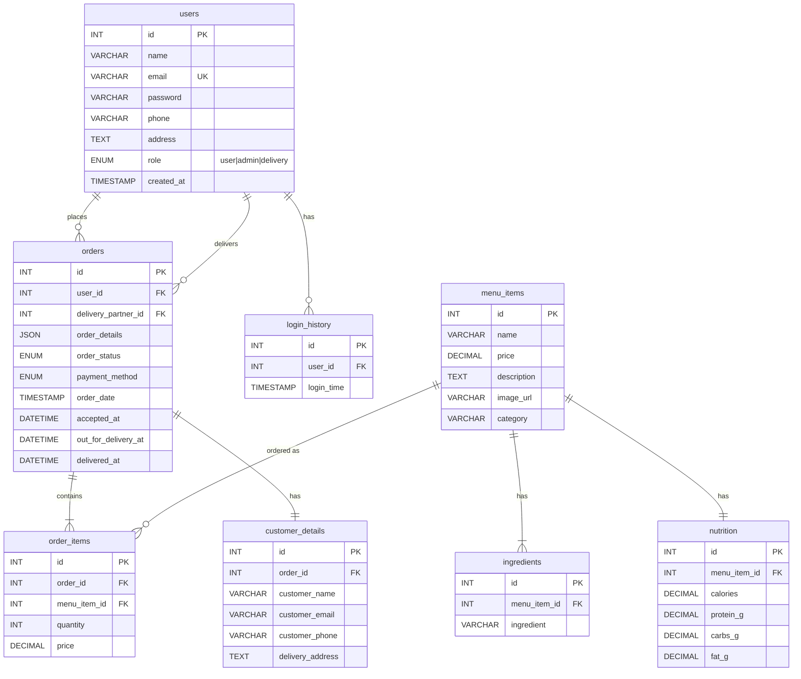

# 🍽️ DelishDish — Food Order & Delivery Platform

A full-stack food ordering and delivery web application with role-based access for **Customers**, **Admin**, and **Delivery Partners**. Built with Node.js, Express, MySQL, and vanilla HTML/CSS/JS with TailwindCSS.

---

## 📸 Overview

| Role | Page | Description |
|------|------|-------------|
| **Customer** | `index.html` | Browse menu, add to cart, place orders, track status, BMI/fitness tool |
| **Admin** | `admin.html` | Manage orders, menu items (CRUD), delivery partners |
| **Delivery** | `delivery.html` | Accept orders, update status (Out for Delivery → Delivered) |

---

## 🛠️ Tech Stack

| Layer | Technology |
|-------|-----------|
| **Backend** | Node.js + Express 5 |
| **Database** | MySQL 8 (via `mysql2/promise`) |
| **Auth** | JWT (`jsonwebtoken`) + bcrypt password hashing |
| **Email** | Nodemailer (Gmail SMTP) |
| **Frontend** | Vanilla HTML/JS + TailwindCSS (CDN) |
| **Fonts** | Google Fonts (Roboto, Poppins, Satisfy) |

---

## 📁 Project Structure

```
food-order-delivery/
├── food_order_db.sql          # Full database schema + seed data
├── README.md                  # This file
├── .gitignore                 # Git ignore rules
│
└── web/                       # Application root
    ├── .env                   # Environment variables (DB, email, JWT)
    ├── server.js              # Express backend (1100+ lines, all API routes)
    ├── create-hash.js         # Utility: generate bcrypt hash for admin password
    ├── package.json           # Node dependencies
    ├── package-lock.json      # Lockfile
    │
    └── public/                # Static frontend files (served by Express)
        ├── index.html         # Customer-facing homepage + ordering UI
        ├── admin.html         # Admin dashboard
        ├── delivery.html      # Delivery partner portal
        ├── script.js          # Customer page JS (if separated)
        ├── orders.js          # Order-related JS (if separated)
        ├── style.css          # Global styles
        └── image/             # Local food images (12 assets)
            ├── briyani.webp
            ├── burger.jpg
            ├── chicken-butter-masala-recipe.jpg
            └── ... (9 more images)
```

---

## 🗄️ Database Schema (3NF Normalized)

The database follows **Third Normal Form (3NF)** with proper foreign key relationships:



### Key Normalization Details

- **`ingredients`** — Separated from `menu_items` to eliminate repeating groups (1NF → 3NF)
- **`nutrition`** — One-to-one with `menu_items`, avoids nullable column bloat
- **`customer_details`** — Snapshot of customer info per order, avoids redundancy in `orders`
- **`order_items`** — Junction table stores item price at time of order (historical accuracy)

---

## 🔐 Authentication & Roles

| Role | Login | Capabilities |
|------|-------|-------------|
| `user` | Signup + Login | Browse menu, place orders, cancel orders, track orders, BMI tool |
| `admin` | Pre-seeded | View all orders, CRUD menu items, manage delivery partners, assign orders |
| `delivery` | Created by Admin | View available orders, accept orders, update status progression |

**Auth Flow**: Email + Password → JWT token (1hr expiry) → Bearer token in Authorization header

---

## 📡 API Endpoints

### Auth
| Method | Endpoint | Auth | Description |
|--------|----------|------|-------------|
| `POST` | `/api/signup` | — | Register new customer |
| `POST` | `/api/login` | — | Login (returns JWT + role) |
| `POST` | `/api/forgot-password` | — | Send password reset email |
| `POST` | `/api/reset-password` | — | Reset password with token |

### Menu (Public)
| Method | Endpoint | Auth | Description |
|--------|----------|------|-------------|
| `GET` | `/api/menu_items` | — | List all menu items |

### Orders (Customer)
| Method | Endpoint | Auth | Description |
|--------|----------|------|-------------|
| `POST` | `/api/orders` | User | Place new order |
| `GET` | `/api/orders/user/:userId` | User/Admin | Get user's order history |
| `DELETE` | `/api/orders/:orderId` | User | Cancel order (if cancellable) |
| `GET` | `/api/orders/track/:orderId` | User/Admin | Track order status |
| `GET` | `/api/orders/cancel-from-email/:orderId/:token` | — | Cancel via email link (5 min) |

### Admin
| Method | Endpoint | Auth | Description |
|--------|----------|------|-------------|
| `GET` | `/api/admin/orders` | Admin | View all orders |
| `PUT` | `/api/admin/orders/:orderId/status` | Admin | Update order status |
| `POST` | `/api/admin/menu_items` | Admin | Add new menu item |
| `PUT` | `/api/admin/menu_items/:id` | Admin | Update menu item |
| `DELETE` | `/api/admin/menu_items/:id` | Admin | Delete menu item |
| `POST` | `/api/admin/delivery_partners` | Admin | Add delivery partner |
| `GET` | `/api/admin/delivery_partners` | Admin | List delivery partners |
| `PUT` | `/api/admin/orders/:orderId/assign/:partnerId` | Admin | Assign order to partner |

### Delivery Partner
| Method | Endpoint | Auth | Description |
|--------|----------|------|-------------|
| `GET` | `/api/delivery/orders/available` | Delivery | View available orders |
| `GET` | `/api/delivery/orders/my` | Delivery | View accepted orders |
| `PUT` | `/api/delivery/orders/:orderId/accept` | Delivery | Accept an order |
| `PUT` | `/api/delivery/orders/:orderId/status` | Delivery | Update status progression |

### Fitness
| Method | Endpoint | Auth | Description |
|--------|----------|------|-------------|
| `POST` | `/api/fitness` | — | Calculate BMI + food recommendations |

---

## 🚀 Getting Started

### Prerequisites

- **Node.js** ≥ 18.x
- **MySQL** ≥ 8.0
- **npm** (comes with Node.js)

### 1. Clone the Repository

```bash
git clone <repository-url>
cd food-order-delivery
```

### 2. Set Up the Database

```bash
# Login to MySQL
mysql -u root -p

# Create the database
CREATE DATABASE food_order_db;

# Run the schema + seed script
source food_order_db.sql;
```

### 3. Configure Environment Variables

Edit `web/.env` with your credentials:

```env
DB_HOST=localhost
DB_USER=root
DB_PASSWORD=your_mysql_password
DB_NAME=food_order_db

GMAIL_USER=your_email@gmail.com
GMAIL_APP_PASSWORD=your_app_password

JWT_SECRET=your_secret_key
PORT=3000
```

> **Note**: For Gmail, you need to generate an [App Password](https://support.google.com/accounts/answer/185833) (requires 2FA enabled).

### 4. Install Dependencies

```bash
cd web
npm install
```

### 5. Start the Server

```bash
npm start
# or
node server.js
```

### 6. Open in Browser

```
http://localhost:3000          → Customer Homepage
http://localhost:3000/admin.html    → Admin Dashboard
http://localhost:3000/delivery.html → Delivery Portal
```

---

## 👤 Default Admin Account

| Field | Value |
|-------|-------|
| Email | `arunkumar30102006@gmail.com` |
| Password | `Ak@30102006` |

> ⚠️ **Change the default admin password in production!**

---

## ✨ Key Features

### Customer Portal (`index.html`)
- 🍕 Browse menu with category filters (Standard, Weight Loss, Weight Gain, Balanced)
- 🛒 Add-to-cart with quantity management
- 📧 Order confirmation emails with 5-minute cancellation link
- 📦 Real-time order tracking (Processing → Accepted → Out for Delivery → Delivered)
- 💪 BMI Calculator with personalized food recommendations
- 🔐 User signup/login with JWT authentication
- 🔑 Forgot/Reset password via email

### Admin Dashboard (`admin.html`)
- 📊 View all orders with status, customer info, and assigned partner
- 🍽️ **Menu Management** — Card-grid view with search, category filters, image thumbnails, nutrition chips
- ➕ **Add Menu Items** — Two-column form with live image preview, real-time nutrition preview, category selection with emojis
- 👥 **Delivery Partner Management** — Add partners with auto-generated passwords, card-based partner display with gradient avatars
- 🔔 Toast notifications for all actions

### Delivery Portal (`delivery.html`)
- 📋 View available orders to accept
- ✅ Accept orders and take ownership
- 🚚 Update status: Accepted → Out for Delivery → Delivered
- 📊 View personal active deliveries

---

## 📦 Dependencies

| Package | Version | Purpose |
|---------|---------|---------|
| `express` | ^5.1.0 | Web framework |
| `mysql2` | ^3.15.0 | MySQL driver (promise-based) |
| `bcrypt` | ^5.1.1 | Password hashing |
| `jsonwebtoken` | ^9.0.2 | JWT auth tokens |
| `nodemailer` | ^7.0.6 | Email sending (order confirmations, password reset) |
| `cors` | ^2.8.5 | Cross-origin resource sharing |
| `body-parser` | ^2.2.0 | Parse JSON request bodies |
| `dotenv` | ^17.2.2 | Environment variable loading |
| `moment` | ^2.30.1 | Date/time utilities |
| `axios` | ^1.12.2 | HTTP client (if needed) |

---

## 📋 Order Status Flow

```
Processing → Awaiting Acceptance → Accepted → Out for Delivery → Delivered
     ↓              ↓                 ↓
  Cancelled      Cancelled          Cancelled
```

- **Processing** → Initial state after customer places order
- **Awaiting Acceptance** → Admin assigned a partner (optional flow)
- **Accepted** → Delivery partner accepted the order
- **Out for Delivery** → Partner is en route
- **Delivered** → Order completed
- **Cancelled** → Customer cancelled (within allowed window)

---

## 🛡️ Security Notes

- Passwords are hashed with **bcrypt** (10 salt rounds)
- JWT tokens expire after **1 hour**
- Email cancellation links expire after **5 minutes**
- Role-based middleware protects admin/delivery routes
- SQL queries use **parameterized statements** (no SQL injection)
- `.env` file contains secrets — **never commit to public repos**

---

## 📄 License

ISC

---

<p align="center">
  Built with ❤️ by <strong>Arun Kumar</strong>
</p>
